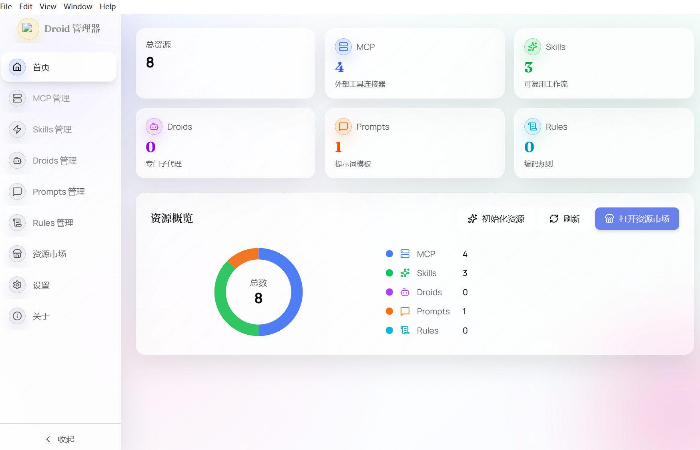
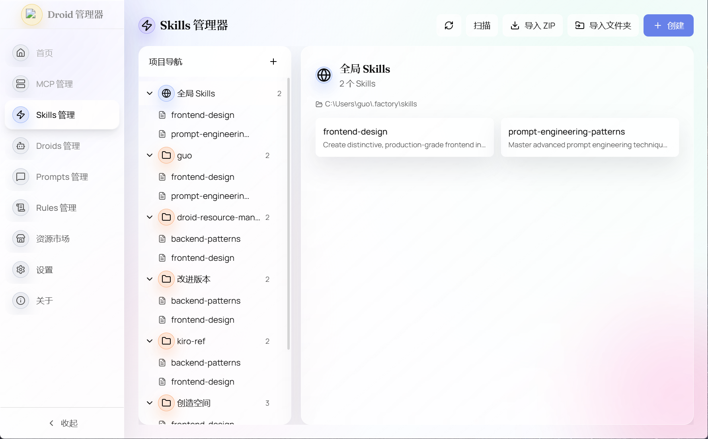

# Droid Resource Manager

[English](README.en.md)

Droid 资源管理器是一个桌面端应用，用于统一管理 **Droids / Skills / MCP / Prompts / Rules** 等资源，基于 Electron + React + Vite 构建。

## 功能概览
- 首页概览与手动初始化资源
- Droids：创建/复制、拖拽移动、工具与配置更新
- Skills：创建/编辑/删除、AI 解读手动触发
- MCP：服务与工具列表查看
- Prompts / Rules：资源查看与维护
- 资源市场与设置（导入/导出）

## 界面截图

## 快速开始
~~~bash
npm install
npm run dev
~~~

## 构建与打包
~~~bash
npm run build
npm run dist
~~~

## 资源扫描与数据来源
- 全局资源：`~/.factory`（droids、skills 等）
- 项目资源：`<project>/.factory`
- 首页“初始化资源”用于手动扫描并刷新缓存

## 目录结构
~~~
electron/        # Electron 主进程与 IPC
src/             # React 前端
public/          # 图标等静态资源
screenshots/     # README 截图
release/         # 打包产物（LFS）
~~~

## Release 与 Git LFS
release 目录下的 exe 使用 Git LFS 跟踪：
~~~bash
git lfs install
git lfs pull
~~~

## License
MIT
